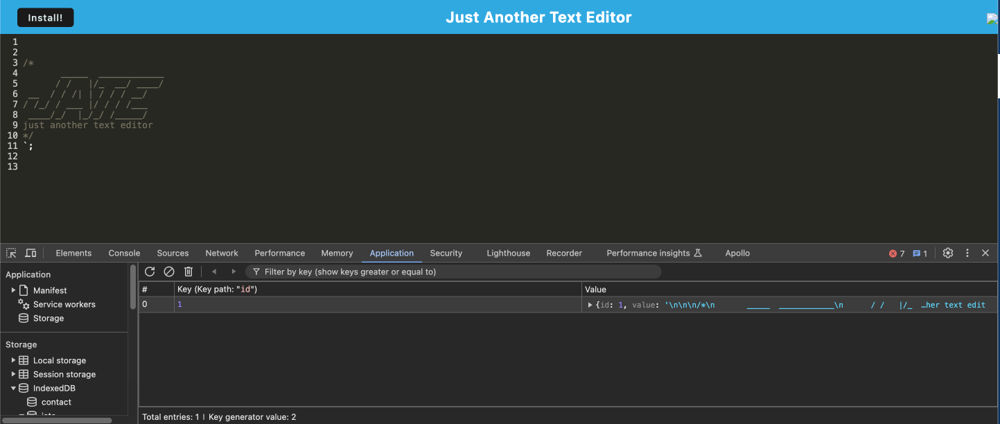
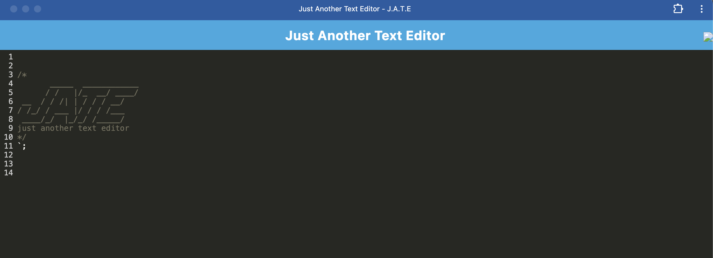
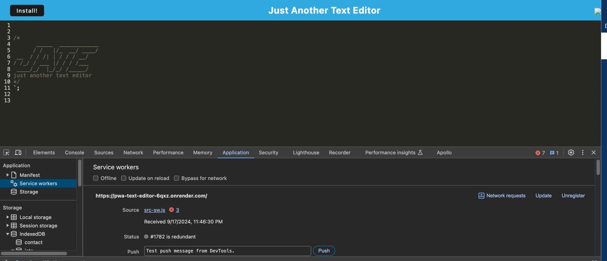

  # PWA Text Editor

  

  ## Description
  A text editor that runs in the browser initially. It is a single page application that meets PWA (Progressive Web Application) criteria. It features the ability to function offline with a service worker and features a number of data persistence techniques that serve as redundancy

  ## URL of Deployed Application

[PWA Text Editor deployed to Render](https://pwa-text-editor-6qxz.onrender.com)

  ## Screenshots of Deployed Application

  

  

  

  ## Table of Contents
  - [Installation](#installation)
  - [Usage](#usage)
  - [Contributing](#contributing)
  - [Tests](#tests)
  - [Technologies](#technologies)
  - [License](#license)
  - [Questions](#questions)

  ## Installation
  This app runs in a browser, but if you'd like to run it on your local, clone the repository, and run the following commands: npm install  npm run start. This will install all dependencies and build out the app and start it. Then you will be able to run the application in localhost:300

  ## Usage
  This is an application that allows you to use a text editor offline and/or as a PWA

  ## Contributing
  N/A

  ## Tests
  N/A

  ## Technologies
  

   ## License
  MIT

  ## Questions

  For any additional questions or feedback, please contact me with the following information:
  Github: (https://github.com/tjmcd2010)
  Email: (mailto:tjmcd2010@gmail.com)  

